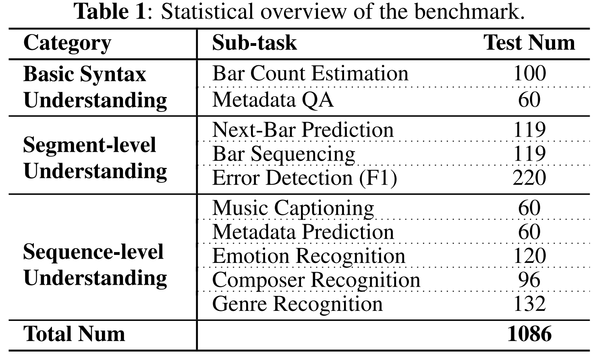

# ABC-Eval

This is the official release of the benchmark ABC-Eval, corresponding to the paper: "ABC-EVAL: BENCHMARKING LARGE LANGUAGE MODELS
ON SYMBOLIC MUSIC UNDERSTANDING AND INSTRUCTION FOLLOWING".

## 1. Overview

This benchmark contains 1,086 test samples from 10 sub-tasks, the statistical overview is shown in the following figure:

<figure>

  
## 2. Dataset Details


This benchmark aggregates **5** public datasets, all included datasets follow their original licenses. Note that this benchmark is for research use only, and is prohibited for commercial purposes.<br/> 
**Please strictly follow the corresponding license when using and sharing this benchmark.**


| Dataset Name     | Relevant File(s)                  | License Type | Citation | URL | 
| ---------------- | ---------------------------------------------- | ------------ | ----------------- |  ----------------- |
| **EMOPIA**           | Emotion_Recognition.csv | **CC BY-NC-SA 4.0**   |H. Hung, J. Ching, S. Doh, N. Kim, J. Nam, and Y. Yang, “EMOPIA: A multi-modal pop piano dataset for emotion recognition and emotion-based music generation,” ISMIR 2021, pp. 318–325. | https://zenodo.org/records/5090631#.YQEZZ1Mzaw5|
| **ADL Piano Midi**   | Genre_Recognition.csv | **CC BY 4.0** | L. N. Ferreira, L. H. Lelis, and J. Whitehead, “Computer-generated music for tabletop role-playing games,” AIIDE'20, 2020  | https://github.com/lucasnfe/adl-piano-midi   |
| **IrishMAN**         | Bar_Count_Estimation.csv; Error_Detection.csv | **MIT**   | S. Wu, X. Li, F. Yu, and M. Sun, “Tunesformer: Forming irish tunes with control codes by bar patching,” in Proceedings of the 24th International Society for Music Information Retrieval Conference (ISMIR 2023). |  https://huggingface.co/datasets/sander-wood/irishman  |
| **Nottingham Music** | Metadata_QA.csv; Metadata_Prediction.csv; Next_Bar_Prediction.csv; Bar_Sequencing.csv; Music_Captioning.csv | **GNU GPLv3**   | / | https://github.com/jukedeck/nottingham-dataset |
| **Pianist 8**        | Composer_Recognition.csv | **Open (not mentioned)**   | Y. Chou, I. Chen, C. Chang, J. Ching, and Y. Yang, “Midibert-piano: Large-scale pre-training for symbolic music understanding,” CoRR, vol. abs/2107.05223, 2021. | https://zenodo.org/records/5089279 |


## 3. Dataset Description


All csv files contain the following fields: "title, score, choices, target, target_index, task_description"

**"title"**: the original music captions or the names of the original music files;<br/> 
**"score"**: the input ABC notation scores;<br/> 
**"choices"**: the candidates to be chosen in multiple-choice tasks and Bar Sequencing task;<br/> 
**"target"**: the correct answer for non-multiple-choice tasks;<br/> 
**"target_index"**: the 0-indexed positions for the correct answer;<br/> 
**"task_description"**: the textual description of the corresponding sub-task.<br/> 

For Error Detection sub-task, the csv file also has an additional field **"error"**, which describes the inserted errors.


## 4. Prompt Templates


We shared our prompt templates used for testing multiple-choice tasks and non-multiple-choice tasks.

**prompt for multiple-choice tasks:**
```
prompt = f"""
Input：{input_content}
Task：{task_instruction}
Options：
0. {options[0]}
1. {options[1]}
2. {options[2]}
3. {options[3]}
Please only output the index of the correct option (0, 1, 2, or 3), do not output any additional content.
```

**prompt for non-multiple-choice tasks:**
```
prompt = f"""Input：{input_content}
                Task：{task_instruction}
                Template: {structured_output_template}
                Please directly output the answer of the given task, without any explanation or additional content."""
```


